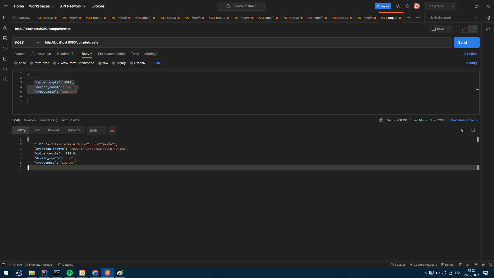
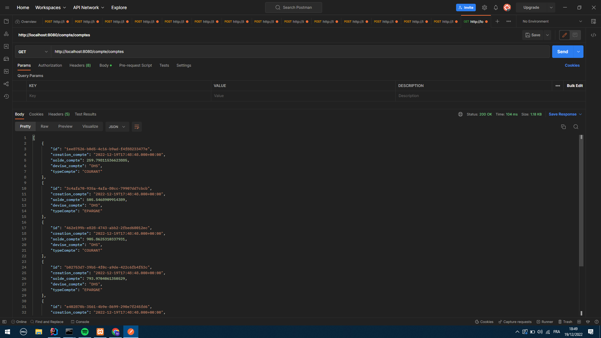
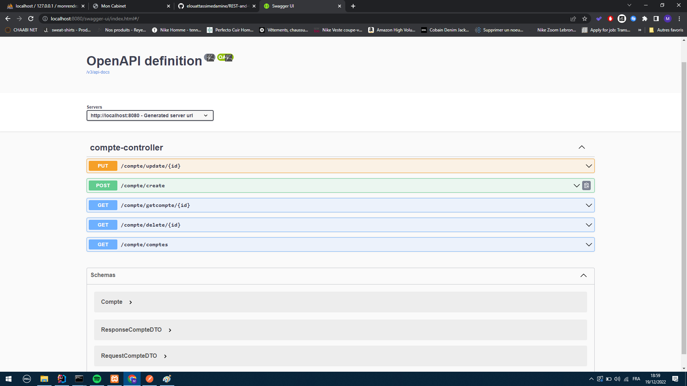
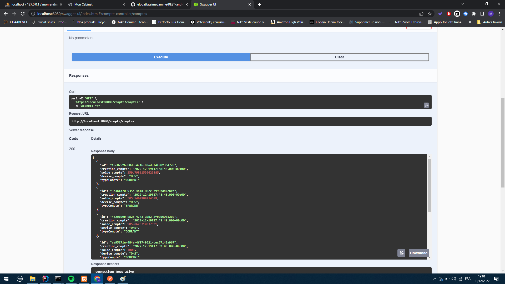
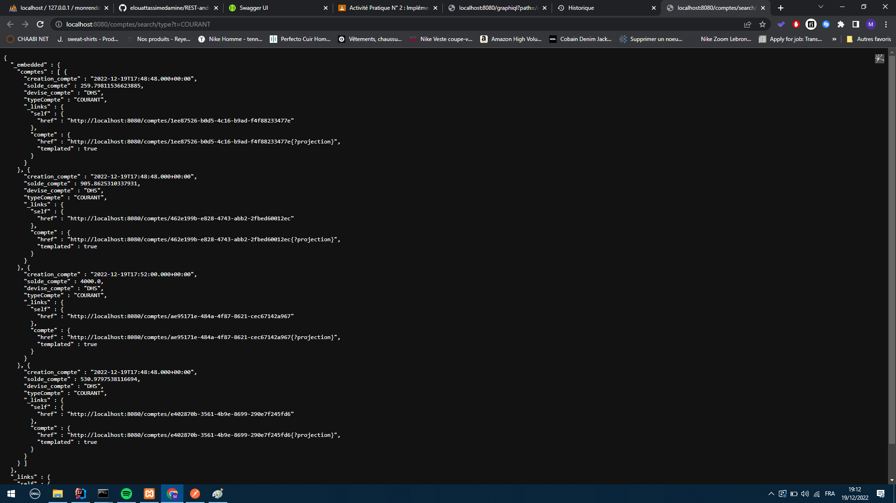
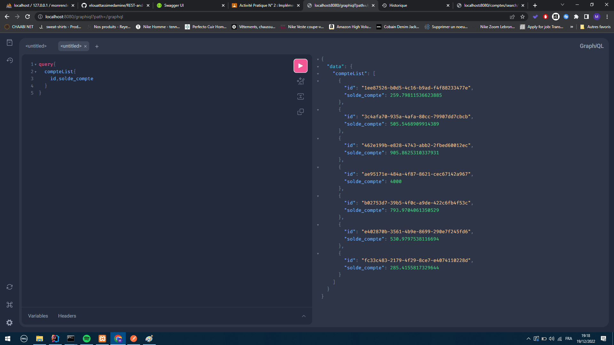
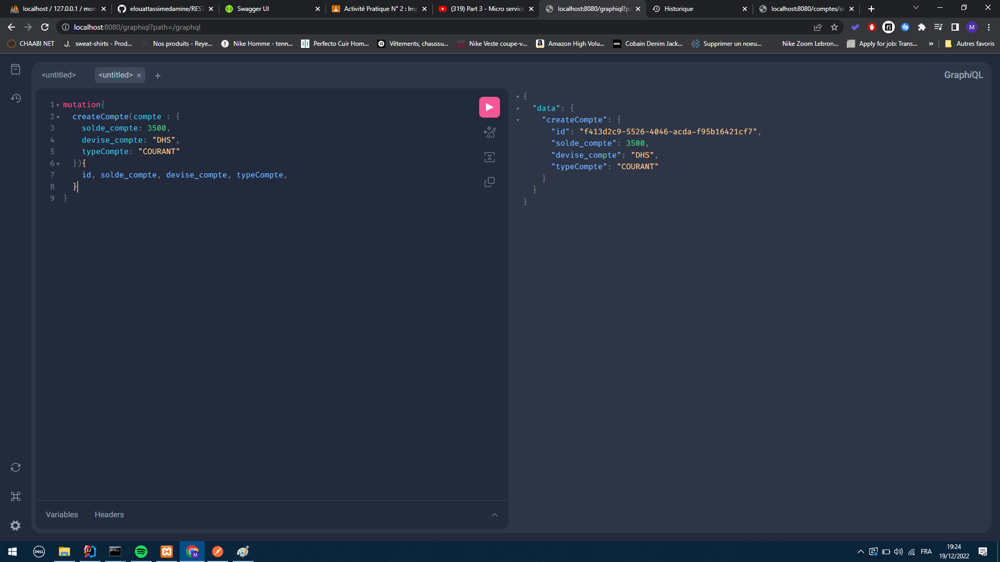

<h1>Rapport du projet</h1>
<h2>Strucuture du projet</h2>

Le projet est strucuturé sur différente couche

<ul>
<li>Couche WEB</li>
<li>Couche Service</li>
<li>Couche DAO</li>
</ul>
<h2>Teste de la couche web en utilisant  Postman</h2>

Comme le montre la capture ci-dessous la méthode create un compte prend en parmètre que le solde, la devise et le type de compte.

L'id et la date de création sont générer de manière automatique dans la couche métier

Quand on appelle la méthode comptes tous les comptes sont affichés

<h2>Teste de la documentation Swagger de des API Rest du Web service</h2>

Swagger permet de faire les memes testes que Postman, sauf que l'avantage avec swagger c'est qu'il connait deja toutes les méthodes créer sur la couhce web et donc il est plus facile de faire des testes

Appelle de la méthode comptes depuis swagger

<h2>Exposer une API Restful en utilisant Spring Data Rest en exploitant des projections</h2>

On utilise les projections pour définir des sous couches d'une entité par exemple les informations affichées dans une applications web ne sont pas les mêmes affichées dans une application mobile

Et donc on utilise les projections pour remedier à cela grace à l'annotation @Projection on peut m^me définir des focntions liées à la BD spécialement pour la projection grace à l'annotation @RESTRESSOURCE

<h3>Exemple</h3>

Dans notre exemple nous avons fait un recherche par le type de compte "EPRAGNE" ou "COURANT"

Le résultat sont tous les comptes de type "COURANT" le resultat affiché est toutes les informations liées au compte sauf l'id du compte car on peut juger que ce n'est pas une information impértinante pour l'utulisateur

<h2>Teste du web service avec GraphQL</h2>

Avec GraphQL on peut controler tous les aspect des retoures de notre couche web

Exemple on souhaite avoir que les ID et les soldes des comptes même si une tels fonction n'a pas été crée grace à GrapheQl ces opérations sont possibles 

Ajout d'un nouveau compte

